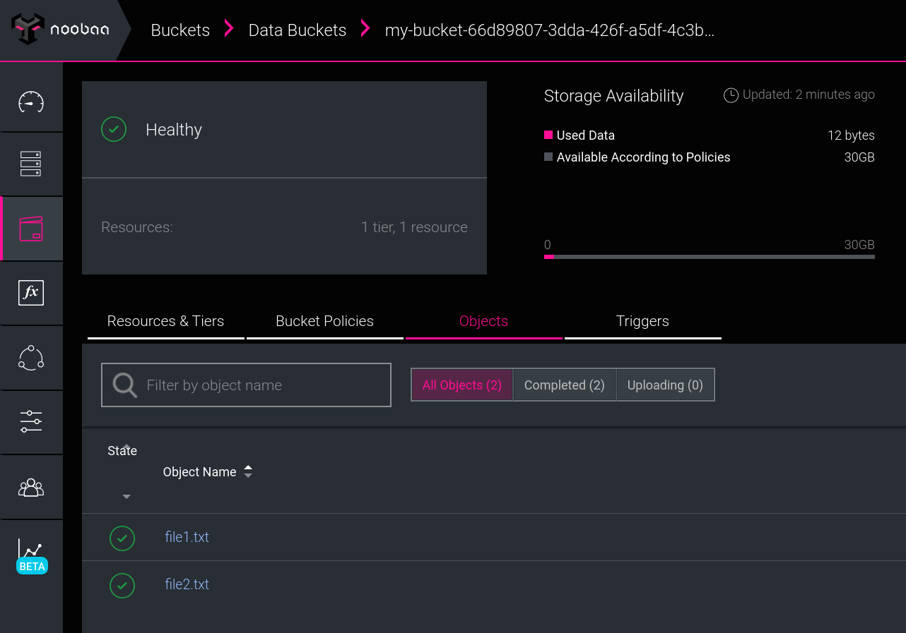

# Dataset Lifecycle Framework

The *__Dataset Lifecycle Framework__* enables users or administrators of Kubernetes
clusters to easily link applications with data sources. Thanks to the new
__Dataset CRD__ (*Custom Resource Definition*) all you need to do is to create a dataset, and include the
dataset ID as a label in your pods specification. Annotated pods will have
access to tha data with no need for providing any futher information on tha data
sources.
Our framework takes care of all the dirty details of __mounting or
giving your pods access to the data__. Once a dataset exists in a Kubernetes cluster,
users will just need to reference it using the unique ID defined at creation time.

This framework targets any *Kubernetes 1.15+* installation; it is built on the
[Operator SDK](https://github.com/operator-framework/operator-sdk) and is extensible to support any
[CSI](https://kubernetes-csi.github.io/docs/) enabled storage system.


## Roadmap

- ~Support for NFS directories as Datasets [pull/3](https://github.com/IBM/dataset-lifecycle-framework/pull/3)~
- ~Support lookup for Dataset information in Hive metastore [pull/4](https://github.com/IBM/dataset-lifecycle-framework/pull/4)~
- Pluggable caching mechanism, working branch: https://github.com/IBM/dataset-lifecycle-framework/tree/fixed-caching
- Integration with Multi-Cloud Object Gateway (Noobaa)
- Optimizations for data-aware scheduling

## Quickstart

If you prefer to watch a quick demo of its functionality, have a look at the recording:
[Demo](https://asciinema.org/a/276331)

The following steps demonstrate how to quickly getting started with our
framework using *minikube*. Check the 
[minikube documentation](https://kubernetes.io/docs/setup/learning-environment/minikube/)
for instructions about how to install it. In case you want to deploy our framework on a proper kubernetes
cluster inspect the [Makefile](Makefile) to tailor your Dataset Lifecycle Framework installation.


### Requirements
- Docker
- git
- Kubernetes CLI (*kubectl*)

### Deployment and usage
Before starting this step, please make sure your Kubernetes CLI (*kubectl*) is
properly configured to interact with your minikube environment. The command `make minikube-install` will
take a bit as it builds the framework's components from scratch.

Make also sure our minikube environment has enough resources, below the minimal
configuration to ensure a successful run:
```bash
$ minikube start --memory='6000mb' --cpus=4
```

To start the installation:
```bash
$ make minikube-install
```

Verify the installation by making sure the following pods are running:
```
$ kubectl get pods
NAME                                READY   STATUS      RESTARTS   AGE
csi-attacher-nfsplugin-0            2/2     Running     0          15s
csi-attacher-s3-0                   1/1     Running     0          17s
csi-nodeplugin-nfsplugin-25x92      2/2     Running     0          15s
csi-provisioner-s3-0                2/2     Running     0          18s
csi-s3-qvbfm                        2/2     Running     0          18s
dataset-operator-54b74d5885-zb78z   1/1     Running     0          15s
example-noobaa-data-9rnxd           0/1     Completed   0          6m4s
my-pv-bs-noobaa-noobaa-0            1/1     Running     0          8m19s
my-pv-bs-noobaa-noobaa-1            1/1     Running     0          8m15s
my-pv-bs-noobaa-noobaa-2            1/1     Running     0          8m10s
noobaa-core-0                       2/2     Running     0          9m22s
noobaa-operator-7d479b7f7b-m98fs    1/1     Running     0          9m44s
```

As part of the minikube installation we deployed [NooBaa](https://noobaa.io) and
added sample data for demo purposes. An S3 bucket is created in NooBaa using an
object bucket claim (OBC).
We also download the NooBaa CLI (v2.0.10) in `./examples/noobaa/noobaa`.
As a user now you can use any Dataset stored on NooBaa inside your pods.
To check the NooBaa installation configuration run the following command:

```bash
$ ./examples/noobaa/noobaa status

#------------------#
#- Mgmt Addresses -#
#------------------#

ExternalDNS : []
ExternalIP  : []
NodePorts   : [https://192.168.39.122:30827]
InternalDNS : [https://noobaa-mgmt.default.svc:443]
InternalIP  : [https://10.102.146.205:443]
PodPorts    : [https://172.17.0.5:8443]

#--------------------#
#- Mgmt Credentials -#
#--------------------#

email    : admin@noobaa.io
password : HM7HwZJ+DG+1MO5FnJSONA==

#----------------#
#- S3 Addresses -#
#----------------#

ExternalDNS : []
ExternalIP  : []
NodePorts   : [https://192.168.39.122:32434]
InternalDNS : [https://s3.default.svc:443]
InternalIP  : [https://10.103.161.163:443]
PodPorts    : [https://172.17.0.5:6443]

#------------------#
#- S3 Credentials -#
#------------------#

AWS_ACCESS_KEY_ID     : M62tJattECtRRseKLkb0
AWS_SECRET_ACCESS_KEY : wSMf8YVqF0cyFIYc2APwMLVBQL7rUfmaZ9ekOsi8

#------------------#
#- Backing Stores -#
#------------------#

NAME       TYPE      TARGET-BUCKET   PHASE   AGE    
my-pv-bs   pv-pool                   Ready   5m1s   

#------------------#
#- Bucket Classes -#
#------------------#

NAME                          PLACEMENT                                         PHASE   AGE     
noobaa-default-bucket-class   {Tiers:[{Placement: BackingStores:[my-pv-bs]}]}   Ready   4m51s   

#-----------------#
#- Bucket Claims -#
#-----------------#

NAMESPACE   NAME              BUCKET-NAME                                      STORAGE-CLASS       BUCKET-CLASS                  PHASE   
default     my-bucket-claim   my-bucket-66d89807-3dda-426f-a5df-4c3b790acff5   default.noobaa.io   noobaa-default-bucket-class   Bound 

```
The above screenshot shows the bucket created for this demo and some other
information such as S3 endpoint and credentials that you'll need later in
this tutorial.


To inspect the newly created NooBaa bucket run:

```bash
$ ./examples/noobaa/noobaa ui

INFO[0000] ✅ Exists: NooBaa "noobaa"                    
INFO[0000] ✅ Exists: Service "noobaa-mgmt"              
INFO[0000] ✅ Exists: Secret "noobaa-operator"           

NooBaa UI (credentials unless using Openshift SSO):
url      : https://localhost:44261
email    : admin@noobaa.io
password : HM7HwZJ+DG+1MO5FnJSONA==

```

A browser session will open up. Login with the credentials provided.
You'll see something like the following screenshot if looking
at the bucket info.




Let's try to access this bucket via a Dataset. What you'll need now is the
information on NooBaa configuration (`AWS_ACCESS_KEY_ID`,
`AWS_SECRET_ACCESS_KEY`), the S3 endpoint and the bucket name.
No worries, we have a script that collects all the info needed and generates
a ready-to-go Dataset description from our templates:

```bash
$ ./examples/noobaa/create_dataset_desc.sh
```
this will generate the file `./examples/noobaa/dataset-noobaa.yaml` that will
look like something like this:

<pre>
apiVersion: com.ie.ibm.hpsys/v1alpha1
kind: Dataset
metadata:
  name: example-dataset
spec:
  local:
    type: "COS"
    accessKeyID: "iQkv3FABR0eywcEeyJAQ"
    secretAccessKey: "MIK3FPER+YQgb2ug26osxP/c8htr/05TVNJYuwmy"
    endpoint: "http://192.168.39.245:31772"
    bucket: "my-bucket-d4078283-dc35-4f12-a1a3-6f32571b0d62"
    region: "" #it can be empty
</pre>

If curious about how the various fields were retrieved please have a look at the
[create_dataset_desc.sh](./examples/noobaa/create_dataset_desc.sh) script.
If instead of the provided NooBaa installation you want to test with another S3
based Cloud Object Storage bucket, feel free to do it. Just make sure the
*endpoint*, *accessKeyID*, *bucket* and *secretAccessKey* fields are properly
filled to connect to your bucket.

It is now time to create the dataset and submit a pod that uses it:

```bash
$ kubectl create -f ./examples/noobaa/dataset-noobaa.yaml
$ kubectl create -f ./examples/templates/example-pod.yaml
```

Verify the dataset was properly created:

```bash
$ kubectl get datasets
NAME              AGE
example-dataset   5s
```

Now inspect the [example-pod](./examples/templates/example-pod.yaml) to see how to use the newly created **example-dataset**

<pre>
apiVersion: v1
kind: Pod
metadata:
  name: nginx
  labels:
    dataset.0.id: <b>"example-dataset"</b>
    dataset.0.useas: "mount"
spec:
  containers:
    - name: nginx
      image: nginx
      volumeMounts:
        - mountPath: "/mount/dataset1" #optional, if not specified it would be mounted in /mnt/datasets/example-dataset
          name: <b>"example-dataset"</b>
</pre>

With the following command you can inspect the running `nginx` pod to verify the dataset is mounted at the provided
path

```bash
$ kubectl exec -it nginx ls /mount/dataset1
file1.txt  file2.txt

```
Feel free to test adding new content to the NooBaa bucket and verify it is immediately
available to the pod by re executing the above command.

Notice the way we annotate the pod to make it aware of the datasets. For instance if we wanted to use multiple datasets,
in the labels section we would have something like this:

```
dataset.0.id: dataset-0
dataset.0.useas: mount

dataset.1.id: dataset-1
dataset.1.useas: mount

dataset.2.id: dataset-2
dataset.2.useas: mount
```

The `mountPath` and `name` in `volumeMounts` is optional and should be used if
the user wants to mount a dataset in a specific location.
If the user doesn't specify the mount point, as a convention we will mount the
dataset on `/mnt/datasets/<dataset-name>`.


## Acknowledgements
This project has received funding from the European Union’s Horizon 2020 research and innovation programme under grant agreement No 825061.

[H2020 evolve](https://www.evolve-h2020.eu/).


