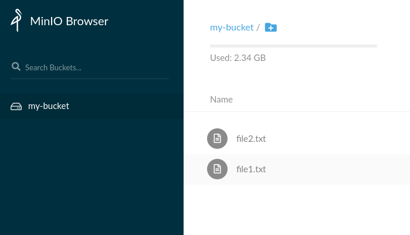

# Dataset Lifecycle Framework

The *__Dataset Lifecycle Framework__* enables users or administrators of Kubernetes
clusters to easily link applications with data sources. Thanks to the new
__Dataset CRD__ (*Custom Resource Definition*) all you need to do is to create a dataset, and include the
dataset ID as a label in your pods specification. Annotated pods will have
access to tha data with no need for providing any futher information on tha data
sources.
Our framework takes care of all the dirty details of __mounting or
giving your pods access to the data__. Once a dataset exists in a Kubernetes cluster,
users will just need to reference it using the unique ID defined at creation time.

This framework targets any *Kubernetes 1.15+* installation; it is built on the
[Operator SDK](https://github.com/operator-framework/operator-sdk) and is extensible to support any
[CSI](https://kubernetes-csi.github.io/docs/) enabled storage system.


## Roadmap

- Support for NFS directories as Datasets [pull/3](https://github.com/IBM/dataset-lifecycle-framework/pull/3)
- Support lookup for Dataset information in Hive metastore [pull/4](https://github.com/IBM/dataset-lifecycle-framework/pull/4)
- Integration with Multi-Cloud Object Gateway (Noobaa)
- Pluggable caching mechanism
- Optimizations for data-aware scheduling

## Quickstart

If you prefer to watch a quick demo of its functionality, have a look at the recording:
[Demo](https://asciinema.org/a/276331)

The following steps demonstrate how to quickly getting started with our
framework using *minikube*. Check the 
[minikube documentation](https://kubernetes.io/docs/setup/learning-environment/minikube/)
for instructions about how to install it. In case you want to deploy our framework on a proper kubernetes
cluster inspect the [Makefile](Makefile) to tailor your Dataset Lifecycle Framework installation.


### Requirements
- Docker
- git
- Kubernetes CLI (*kubectl*)

### Deployment and usage
Before starting this step, please make sure your Kubernetes CLI (*kubectl*) is
properly configured to interact with your minikube environment. The command `make minikube-install` will
take a bit as it builds the framework's components from scratch.

```bash
$ make minikube-install
```

Verify the installation by making sure the following pods are running:
```
$ kubectl get pods
csi-attacher-s3-0                   1/1     Running     0          53m
csi-provisioner-s3-0                2/2     Running     0          53m
csi-s3-qwv7t                        2/2     Running     0          53m
dataset-operator-54b74d5885-bg7sw   1/1     Running     0          53m
```

As part of the minikube installation we deployed [minio](https://min.io) and added sample data for demo purposes.
As a user now you can use any Dataset stored on minio inside your pods. Execute
the following command to have a look at the minio installation:

```bash
$ minikube service minio-service
```

A browser session will open up. Login with `minio`/`minio123` credentials and
you'll see the data available.




Now execute the following:

```
$ export MINIO_SERVICE_URL=$(minikube service minio-service --url)
$ envsubst < ./examples/example-dataset.yaml | kubectl create -f -
$ kubectl create -f ./examples/example-pod.yaml
```

The above commands retrieve the URL of minio inside minikube `minikube service
minio-service --url` and patch the example dataset specification to include it.
The last command finally submits the dataset creation.
The snippet below shows the content of the [example dataset](./examples/example-dataset.yaml)
used with the above commands.
If instead of the provided minio installation you want to test with another S3
based Cloud Object Storage bucket, feel free to do it. Just make sure the
*endpoint*, *accessKeyID*, *bucket* and *secretAccessKey* fields are properly
filled to connect to your bucket.

<pre>
apiVersion: com.ie.ibm.hpsys/v1alpha1
kind: Dataset
metadata:
  name: <b>example-dataset</b>
spec:
  local:
    type: "COS"
    accessKeyID: "minio"
    secretAccessKey: "minio123"
    endpoint: <b>"${MINIO_SERVICE_URL}"</b>
    bucket: "my-bucket"
    region: "" #it can be empty
</pre>

Now inspect the [example-pod](./examples/example-pod.yaml) to see how to use the newly created **example-dataset**

<pre>
apiVersion: v1
kind: Pod
metadata:
  name: nginx
  labels:
    dataset.0.id: <b>"example-dataset"</b>
    dataset.0.useas: "mount"
spec:
  containers:
    - name: nginx
      image: nginx
      volumeMounts:
        - mountPath: "/mount/dataset1" #optional, if not specified it would be mounted in /mnt/datasets/example-dataset
          name: <b>"example-dataset"</b>
</pre>

With the following command you can inspect the running `nginx` pod to verify the dataset is mounted at the provided
path

```bash
$ kubectl exec -it nginx ls /mount/dataset1
file1.txt  file2.txt

```
Feel free to test adding new content to the minio bucket and verify it is immediately
available to the pod by re executing the above command.

Notice the way we annotate the pod to make it aware of the datasets. For instance if we wanted to use multiple datasets,
in the labels section we would have something like this:

```
dataset.0.id: dataset-0
dataset.0.useas: mount

dataset.1.id: dataset-1
dataset.1.useas: mount

dataset.2.id: dataset-2
dataset.2.useas: mount
```

The `mountPath` and `name` in `volumeMounts` is optional and should be used if
the user wants to mount a dataset in a specific location.
If the user doesn't specify the mount point, as a convention we will mount the
dataset on `/mnt/datasets/<dataset-name>`.


## Acknowledgements
This project has received funding from the European Union’s Horizon 2020 research and innovation programme under grant agreement No 825061.

[H2020 evolve](https://www.evolve-h2020.eu/).


