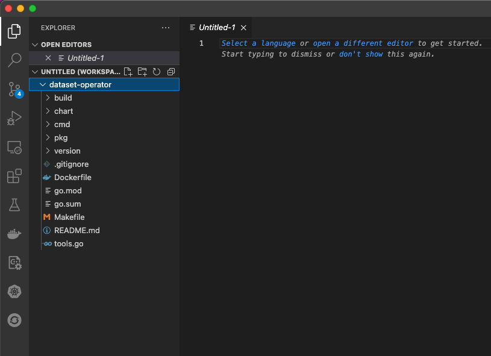
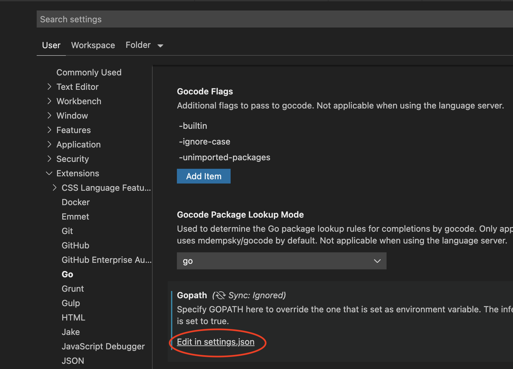

# Recommended environment setup for development


## Setting up Go and VSCode

1. Visit https://go.dev/doc/install to download and install Go on your computer. Alternatively, you can also use package managers for your operating system (e..g Homebrew for macOS)

2. Once installed, run `go version` to verify that the installation is working

3. (Recommended) Go uses a variable `GOPATH` to [point to the current workspace](https://github.com/golang/go/wiki/SettingGOPATH). Package install commands such as `go install` will use this as their destination. If you are using a package as well as extending it, then it would be better to set up a separate workspace for development. To do this, create a separate directory, e.g. `$HOME/goprojects` and set it up with `bin`,`src`, and `pkg` sub-directories, and set `GOPATH` to point to it when developing. You can also use VSCode to modify `GOPATH` per project (see below)

4. Download VSCode from https://code.visualstudio.com/download. Open Extensions tab and search for Go or go to https://marketplace.visualstudio.com/items?itemName=golang.go. Verify that the extension is by Go team at Google. Install extension to VSCode and test it [with a sample program](https://docs.microsoft.com/en-us/azure/developer/go/configure-visual-studio-code)

## Setup Datashim

### Git workflow

We'll roughly follow the Github development flow [used by the Kubernetes project](https://www.kubernetes.dev/docs/guide/github-workflow/). 

1. Visit https://github.com/datashim-io/datashim. Fork your own copy of Datashim to your Github account. For the sake of illustration, let's say this fork corresponds to `https://github.com/$user/datashim` where `$user` is your username.

2. Go to the source directory of your Go workspace and clone your fork there. Using the example above where the workspace is in `$HOME/goprojects`,
   ```
   $> cd $HOME/goprojects/src
   $> git clone https://github.com/$user/datashim.git
   ```

3. Set the Datashim repo as your upstream and rebase
   ```
   $> cd $HOME/goprojects/src/datashim.git
   $> git remote add upstream https://github.com/datashim-io/datashim.git
   $> git remote set-url --push upstream no_push 
   ```
   The last line prevents pushing to upstream. You can verify your remotes by `git remote -v`
   ```
   $> git fetch upstream
   $> git checkout master
   $> git rebase upstream/master
   ```

4. Create a new branch to work on a feature or fix. Before this, please create an issue in the main Datashim repository that describes the problem or feature. Note the issue number (e.g. `nnn`) and assign it to yourself. In your local repository, create a branch to work on the fix. Use a short title (2 or 3 words) formed from the issue title/description along with the issue number as the branch name 

   ```
   $> git checkout -b nnn-short-title
   ```
   Make your changes. Then commit your changes. [Always sign your commits](https://docs.github.com/en/authentication/managing-commit-signature-verification/signing-commits)
   ```
   $> git commit -s -m "short descriptive message"
   $> git push -f $your_remote nnn-short-title
   ```

5. When you are ready to submit a Pull Request (PR) for your completed feature or branch, visit your fork on Github and click the button titled `Compare and Pull Request` next to your `nnn-short-title` branch. This will submit the PR to Datashim.io for review
   
6. After the review, prepare your PR for merging by [squashing your commits](https://medium.com/@slamflipstrom/a-beginners-guide-to-squashing-commits-with-git-rebase-8185cf6e62ec). 

### Setting up Datashim in VSCode

Datashim is a collection of multiple Go projects including the Dataset Operator, CSI-S3, Ceph Cache plugin, etc. Therefore, the VSCode setup is not as straightforward as with a single Go project. 

1. Start VSCode. Open a new window (**File** -> **New Window**). Select the Explorer view (generally the topmost icon on the left pane)

2. Add a folder to the workspace (**File** -> **Add Folder To Workspace**). In the file picker dialog, traverse to `$HOME/goprojects/src/github.com/$user/datashim` and then deeper into subprojects (i.e. `src/` folder). At this point, add the subfolder representing the project that you want to work on (e.g. `dataset-operator`)
   
3. Your Explorer view will have the project in the side panel like so:
   
   

4. If you have followed the advice of having a separate directory for go projects, you need to inform Go plugin in VSCode about it. Open **Preferences** -> **Settings**. Click on **User** or **Workspace** tab. On the left pane, click on **Extensions** -> **Go** and scroll down to **Gopath** on the right-hand pane like so:

    

5. Add these lines to the JSON file:
   ```
   "go.toolsGopath": "$HOME/go",
   "go.gopath": "$HOME/goprojects",
   ```
   where the first line is the Go installation folder and the second line is the folder you've created for hacking.